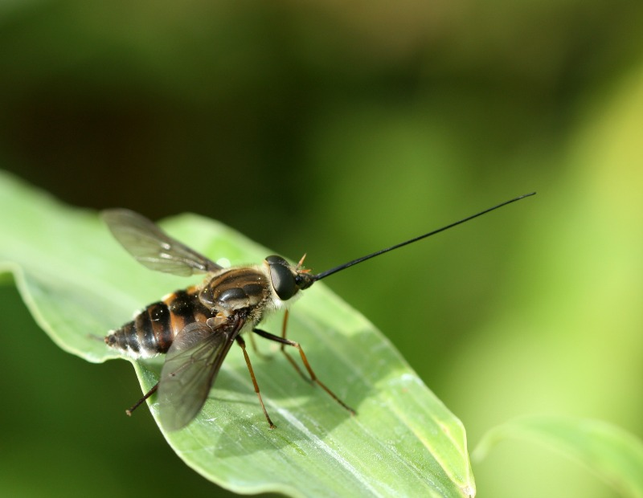

```{r setup, include=FALSE}
knitr::opts_chunk$set(echo = TRUE)
```

## About Me
<br>

<br>

### Education 
* **University of South Florida   |   2015**
  + B.S. Environmental Science & Policy. 
  + B.S. Environmental Biology. 
* **University of Oxford    |   2016**
  + M.S. Biodiversity, Conservation, and Management
* **Cornell University   | In progress**				           
  + Ph.D. Entomology 
<br>

### Research Interests
* Wild pollinator conservation 
* Disease ecology of bees and hover flies
* Impact of land-use change on pollinator communities
* Importance of biotic pollination in crop production

<br>

<br>

