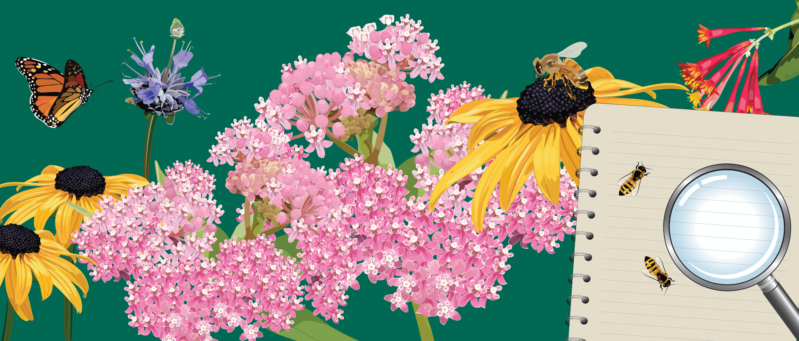

```{r setup, include=FALSE}
knitr::opts_chunk$set(echo = TRUE)
```

## About this site 
My name is **Kaitlin Deutsch**, and this is my GitHub website for Assignment 3. My repositories can be found [here](https://github.com/krdeutsch).
<br>

I have collaborated with **Kass Urban Mead** on this project, whose repositories can be accessed [here](https://github.com/Kass-UM). 

<br>
<br>


